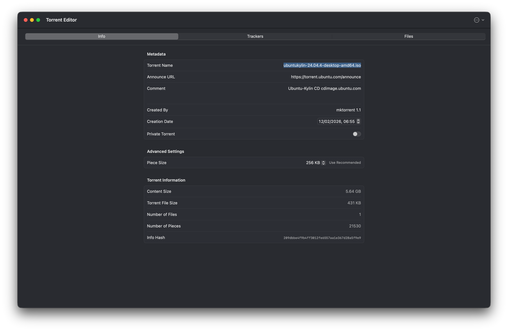
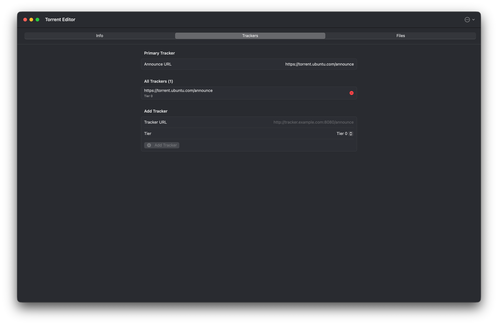
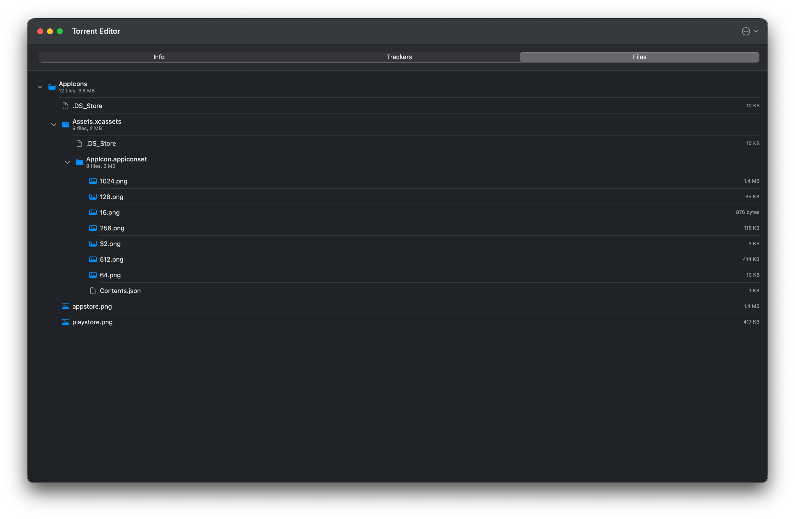
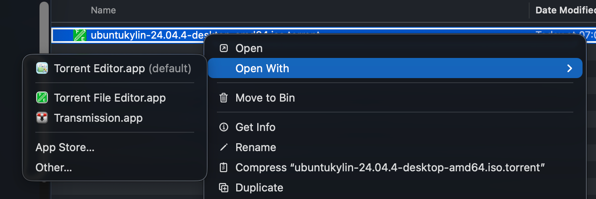

# Torrent Editor

A native macOS app for creating and editing `.torrent` files. Edit metadata, manage trackers, and organise file lists — all in a clean SwiftUI interface.

## Screenshots

### Info


### Trackers


### Files


### Context Menu


## Features

- **Create & edit** `.torrent` files from scratch or by opening existing ones
- **Metadata editing** — name, primary tracker, comment, creation date, private flag
- **Tracker management** — multiple trackers with tier-based fallback support
- **File tree** — add files and folders, colour-coded by type, with remove via context menu
- **Piece size selection** — 11 presets (16 KB–16 MB) with smart size recommendations
- **Info hash** — SHA-1 hash calculated and displayed automatically
- **Registered file handler** — opens `.torrent` files directly from Finder
- **Auto-updates** — built-in Sparkle updater

## Requirements

- macOS 15 or later

## Installation

Download the latest release from the [GitHub Releases](../../releases/latest) page:

1. Download the `.dmg` file
2. Open the DMG and drag **Torrent Editor** into your Applications folder
3. Launch from Applications or Spotlight

Releases are signed and notarized by Apple.

## Building from Source

```bash
git clone https://github.com/ashleyconnor/torrent-editor.git
cd torrent-editor
open "Torrent Editor.xcodeproj"
```

Dependencies are managed via Swift Package Manager and will be resolved automatically by Xcode.

## Contributing

Contributions are welcome. Please follow these steps:

1. Fork the repository and create a branch from `main`
2. Make your changes, keeping commits focused and descriptive
3. Run `swift-format` before committing (config at `Torrent Editor/.swift-format`)
4. Open a pull request against `main` with a clear description of what changed and why

For significant changes, open an issue first to discuss the approach.

## License

See [LICENSE](LICENSE) for details.
